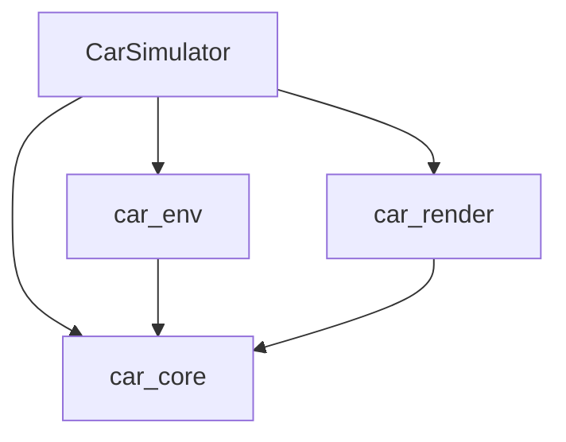
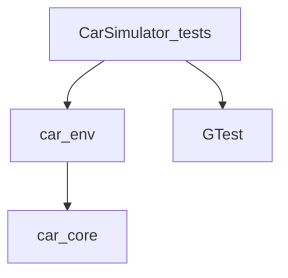

# Build System Architecture

## Overview

This document outlines the build architecutre of the project, including dependency rules, the concept of the build architecture.

## Dependency Summary

| Target               | Direct dependencies                 | Purpose                                                     |
| -------------------- | ----------------------------------- | ----------------------------------------------------------- |
| `car_core`           | None                                | Core simulation models, types, math, and utilities          |
| `car_env`            | `car_core`                          | Simulation environments                                     |
| `car_render`         | `car_core`                          | Rendering, shaders, window handling, and OpenGL integration |
| `CarSimulator`       | `car_core`, `car_env`, `car_render` | Final application executable                                |
| `CarSimulator_tests` | `car_env`, `GTest::gtest_main`      | Current unit-test executable                                |

The intended dependency hierarchy is:

```text
Application layer
    CarSimulator

Domain modules
    car_env
    car_render

Foundation layer
    car_core
```

Dependencies should flow downward toward `car_core`, while application coordination should remain in `CarSimulator`.

## Dependency Convention

In the diagrams below, an arrow points from a target to one of its dependencies.

For example:

```text
car_env --> car_core
```

means that `car_env` depends on and links to `car_core`.

---

## Application Dependency Graph



The  `CarSimulator` executable combines the core simulation logic, simulation environments, and rendering system.

The intended dependency direction is:

```text
car_env    -> car_core
car_render -> car_core

CarSimulator
    -> car_core
    -> car_env
    -> car_render
```

Neither `car_core` nor `car_env` should depend on the final application executable.

---

## Test Dependency Graph



The current tests exercise `ParkingEnv`, so `CarSimulator_tests` links to `car_env`.

Because `car_env` has a `PUBLIC` dependency on `car_core`, the test executable also receives the required `car_core` usage requirements transitively.

The test executable must not depend on `car_render`, GLFW, GLAD, or OpenGL unless graphics-specific tests are intentionally introduced.

---

## Target Responsibilities

### `car_core`

`car_core` contains reusable simulation foundations that do not depend on environments, rendering, window management, or the final application.

Current responsibilities include:

* `BicycleModel`
* `Randomizer`
* Vehicle-state and action types
* Vehicle models
* Mathematical utilities
* Randomization utilities
* Common simulation configuration and constants

`car_core` must remain independent of:

* `ParkingEnv` and other environments
* Rendering classes
* GLFW
* GLAD
* OpenGL
* `Window`
* `Simulator`
* `main()`

---

### `car_env`

`car_env` contains simulation environments that use models and types provided by `car_core`.

Current responsibilities include:

* `ParkingEnv`

Possible future responsibilities include:

* `HighwayEnv`
* `PathTrackingEnv`
* Sensor simulation environments
* Reinforcement-learning environment interfaces
* Observation and reward calculation

Dependency:

```text
car_env -> car_core
```

`car_env` has a `PUBLIC` dependency on `car_core` because its public headers expose and use core types such as vehicle states, actions, positions, and vehicle models.

---

### `car_render`

`car_render` contains graphics, rendering, shader, window, and OpenGL-related implementation.

Current responsibilities include:

* `Entity`
* `Renderer`
* `ShaderProgram`
* `RectShader`
* `Window`
* `Loader`
* GLAD

Dependency:

```text
car_render -> car_core
```

The rendering system may use core data such as `Position2D`, vehicle states, and vehicle dimensions to visualize the simulation.

In a later build-system task, `car_render` should also own or declare its GLFW and OpenGL dependencies through CMake targets.

---

### `CarSimulator`

`CarSimulator` is the final executable target.

Current source files include:

* `main.cpp`
* `Simulator.cpp`

Dependencies:

```text
CarSimulator
    -> car_core
    -> car_env
    -> car_render
```

`CarSimulator` is responsible for composing the other modules and coordinating the application lifecycle.

For example, it may:

* Create the simulation environment
* Advance the simulation state
* Create and update rendering entities
* Handle the application loop
* Process window events
* Start and stop the simulator

Reusable simulation or rendering logic should not be implemented directly in the executable target when it belongs in one of the library targets.

---

### `CarSimulator_tests`

`CarSimulator_tests` is the current GoogleTest executable.

Current dependencies include:

* `car_env` for `ParkingEnv` tests
* `car_core` transitively through `car_env`
* `GTest::gtest_main`

It intentionally does not link to `car_render`.

This keeps the unit tests independent of:

* OpenGL
* GLFW
* GLAD
* Window creation
* Display availability

This separation is especially important for reliable execution in CI environments.

---

## Future Test Structure

As the number of tests grows, tests may be divided into separate executables based on the target under test.

### `car_core_tests`

Possible test areas include:

* `BicycleModel` behavior
* Vehicle-state calculations
* Mathematical utilities
* `Randomizer` behavior
* Configuration validation

Expected dependencies:

```text
car_core_tests
    -> car_core
    -> GTest
```

### `car_env_tests`

Possible test areas include:

* `ParkingEnv` initialization
* Reset behavior
* Step behavior
* Observation calculation
* Reward calculation
* Success and failure conditions
* Environment boundaries

Expected dependencies:

```text
car_env_tests
    -> car_env
    -> GTest

car_env
    -> car_core
```

Separate test executables are not required immediately. The current `CarSimulator_tests` target can remain until the test suite becomes large enough to justify further separation.

---

## Architectural Dependency Rules

Lower-level targets must not depend on higher-level targets.

### Environment and Core Boundary

The intended dependency is as follows:

```text
car_env -> car_core
```

The reverse dependency must not be introduced:

```text
car_core -X-> car_env
```

For instance, `BicycleModel` must not receive, return, or manage a `ParkingEnv` object.

The environment should use the vehicle model instead:

```text
ParkingEnv
    calls
BicycleModel
```

This keeps the vehicle model reusable in other environments and applications.

---

### Rendering and Core Boundary

The intended dependency is:

```text
car_render -> car_core
```

This is reasonable because the rendering system needs core data such as:

* `Position2D`
* Vehicle state
* Vehicle dimensions
* Heading
* Simulation state

The reverse dependency must not be introduced:

```text
car_core -X-> car_render
```

Core simulation logic must not:

* Call a renderer
* Update an `Entity`
* Create a window
* Invoke GLFW
* Invoke OpenGL
* Depend on shader classes

Instead, the application layer should read the simulation state and pass the necessary data to the rendering system.

---

### Environment and Rendering Boundary

Ideally, `car_env` and `car_render` shall remain independent sibling targets:

```text
car_env    -> car_core
car_render -> car_core
```

Avoid introducing either of these dependencies:

```text
car_env    -X-> car_render
car_render -X-> car_env
```

The `CarSimulator` executable should coordinate data transfer between them:

```text
car_env
    produces simulation state
        |
        v
CarSimulator
    passes display data
        |
        v
car_render
```

This separation allows environments to be tested without graphics and allows the renderer to visualize data without controlling simulation behavior.
