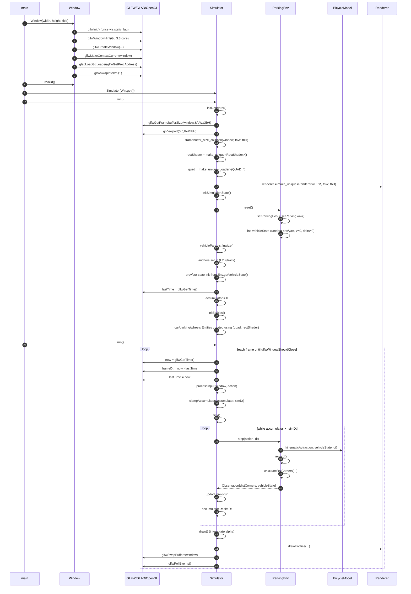

# Class Architecture – Car Simulator
This document explains **how the major classes fit together**, what each layer owns, and the key invariants (especially around OpenGL context/lifetime).  
For the full, exhaustive list of methods/attributes per class, see `class_diagram.md`.

---

## Architecture at a glance

### Layers

1. **Application / Platform**
   - `Window` (GLFW + GLAD + OpenGL context lifetime)
   - `main.cpp` (creates `Window`, then starts `Simulator`)

2. **Simulation Orchestrator**
   - `Simulator` 
      - Input produces `Action`
      - `ParkingEnv::step(Action, dt)` updates `VehicleState` and produces `Observation`
      - `Simulator` stores prev/cur snapshots
      - `draw()` interpolates and renders

3. **Environment (Parking task)**
   - `ParkingEnv` (step the environment by one time step, parking slot placement, termination checks, reward computation, reset the environment)
   - `ParkingParams` (success tolerances)

4. **Vehicle Dynamics**
   - `BicycleModel` (kinematic bicycle update)
   - `VehicleTypes` (`VehicleState`, `VehicleParams`, `Action`, `Position2D`)
   - `MathUtils` (angle helpers / constants)

5. **Rendering (OpenGL rectangles)**
   - `Renderer` (meters → NDC conversion, draw calls)
   - `Entity` (render instance: pose/size/color + links to mesh/shader)
   - `Loader` (unit quad mesh: VAO/VBO/EBO)
   - `RectShader` → `ShaderProgram` (shader program + cached uniform locations)

6. **Utilities**
   - `Randomizer` (RNG utilities used by `ParkingEnv`)

---

## Dependency rules

- **Pure math / types** (`VehicleTypes`, `MathUtils`, `ParkingParams`) must not depend on OpenGL/GLFW.
- **Dynamics / env** (`BicycleModel`, `ParkingEnv`) should stay OpenGL-free.
- Only the **rendering layer** (`Renderer`, `Loader`, `ShaderProgram`, `RectShader`) touches OpenGL.
- Any creation of RectShader/Loader/Renderer must happen after `Window` has created the context + loaded GLAD.
- `Entity` should not own GPU resources; it should reference shared render resources.
- `Window` owns the GLFWwindow; Simulator only borrows GLFWwindow*. Therefore `Window` must outlive `Simulator`.
---

## Initialization and main loop flow
1. main.cpp
   - Window window(...)
      - calls glfwInit (once), creates GLFWwindow, makes context current, loads GLAD, sets vsync.
   - Simulator sim(window.get()) (stores raw GLFWwindow*)

2. Simulator::init()
   - initRenderer()
      - creates RectShader, Loader(quad), Renderer, sets viewport (fbW/fbH)
   - initSimulationState()
      - env.reset()
      - vehicleParams.finalize(): computes wheel anchors
      - sets prev/cur state, lastTime/accumulator
   - initEntities()
      - constructs car/parking/wheels/entities using the created render resources

3. Simulator::run()
   - per frame
      - processInput()
      - accumulate dt
      - tick() (while accumulator >= simDt: env.step)
      - draw() (interpolation)
      - swap/poll

## Sequence plot for initialization and main loop

