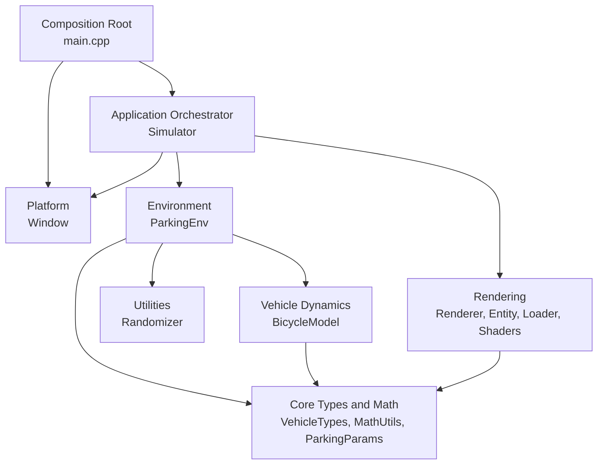
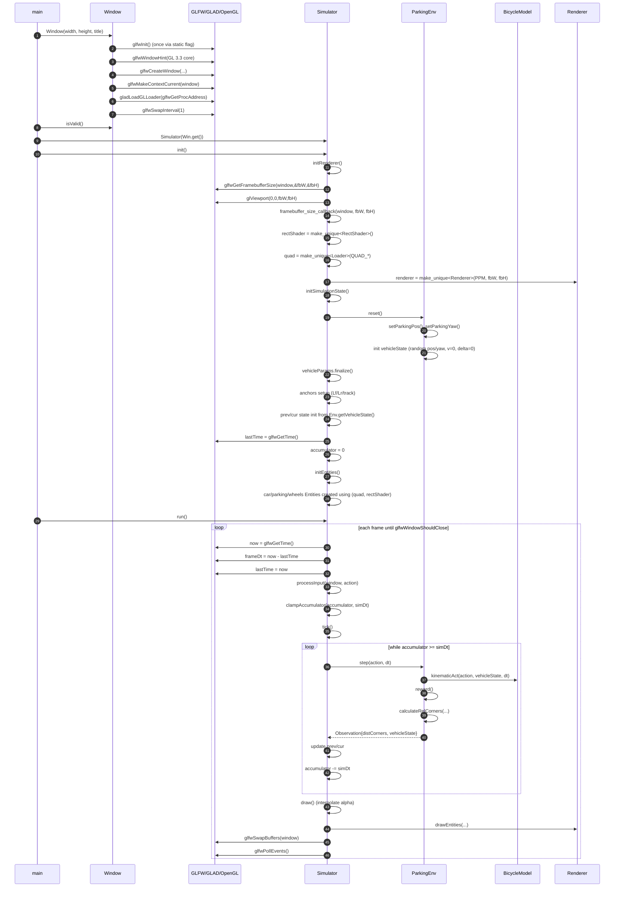

# Class Architecture – Car Simulator
This document explains **how the major classes fit together**, what each layer owns, and the key invariants (especially around OpenGL context/lifetime).  
For the full, exhaustive list of methods/attributes per class, see `class_diagram.md`.

---

## Architecture at a glance

### Layers

1. **Composition Root**
   - `main.cpp`
   - Creates the platform and application objects.
   - Controls their construction and destruction order.

2. **Platform**
   - `Window` 
   - Owns GLFW initialization, the native window, the OpenGL context, and the GLAD initialization.

3. **Simulation Orchestrator**
   - `Simulator` 
      - Input produces `Action`
      - `ParkingEnv::step(Action, dt)` updates `VehicleState` and produces `Observation`
      - `Simulator` stores prev/cur snapshots
      - `draw()` interpolates and renders

4. **Environment (Parking task)**
   - `ParkingEnv` (step the environment by one time step, parking slot placement, termination checks, reward computation, reset the environment)
   - `ParkingParams` (success tolerances)
   - HighwayEnv, other environments shall be here in the future development

5. **Vehicle Dynamics**
   - `BicycleModel` (kinematic bicycle update)
   - Calculates vehicle-state transitions.
   - `VehicleTypes` (`VehicleState`, `VehicleParams`, `Action`, `Position2D`)
   - `MathUtils` (angle helpers / constants)

6. **Rendering (OpenGL rectangles)**
   - `Renderer` (meters → NDC conversion, draw calls)
   - `Entity` (render instance: pose/size/color + links to mesh/shader)
   - `Loader` (unit quad mesh: VAO/VBO/EBO)
   - `RectShader` → `ShaderProgram` (shader program + cached uniform locations)

7. **Utilities**
   - `Randomizer` (RNG utilities used by `ParkingEnv`)

8. **Core Types and Math**
   - `VehicleTypes`
   - `MathUtils`
   - `ParkingParams`
   - Shared data structures, constants, and mathematical helpers.

---

### High-level dependency graph

```mermaid

flowchart TD
    Main["Composition Root<br/>main.cpp"]
    Platform["Platform<br/>Window"]
    Simulator["Application Orchestrator<br/>Simulator"]
    Environment["Environment<br/>ParkingEnv"]
    Dynamics["Vehicle Dynamics<br/>BicycleModel"]
    Core["Core Types and Math<br/>VehicleTypes, MathUtils, ParkingParams"]
    Utilities["Utilities<br/>Randomizer"]
    Rendering["Rendering<br/>Renderer, Entity, Loader, Shaders"]

    Main --> Platform
    Main --> Simulator

    Simulator --> Platform
    Simulator --> Environment
    Simulator --> Rendering

    Environment --> Dynamics
    Environment --> Core
    Environment --> Utilities

    Dynamics --> Core
    Rendering --> Core

```

## Dependency rules

### Core Independence

Core types, mathematical utilities, and vehicle-dynamics logic must be
independent of application, platform, environment, and rendering concerns.

Core code must not:

- Call a renderer
- Update a graphical `Entity`
- Create or manage a window
- Invoke GLFW, GLAD, or OpenGL
- Depend on shader classes
- Depend on `ParkingEnv` or `Simulator`

### Environment and Vehicle-Model Boundary

The environment must use the vehicle model to advance the simulation.

`ParkingEnv` shall call `BicycleModel`, but `BicycleModel` must not know about
or depend on `ParkingEnv`.

The vehicle model should receive vehicle-related input and calculate the
resulting state independently of the active environment. This allows it to be reused by parking, and other environments such as highway-driving, and path-tracking in the future development.

### Simulation and Rendering Boundary

Simulation logic must remain independent of visual presentation.

The rendering layer shall read simulation results such as position, heading,
dimensions, and environment geometry. It must not determine simulation
behavior, calculate rewards, or advance the environment.

`Simulator` is responsible for passing the required state from the simulation to the rendering layer.

### Environment and Rendering Boundary

The environment and rendering layers shall not depend directly on each other.

`ParkingEnv` must not create graphical entities or issue drawing commands.
The renderer must not call `ParkingEnv::step()`, calculate rewards, or modify environment state.
Their interaction is coordinated by `Simulator`.

### OpenGL Context and Resource Lifetime

- OpenGL-dependent resources must be created only after `Window` creates the
  OpenGL context and loads GLAD.
- `Entity` does not own GPU resources; it references shared mesh and shader
  resources.
- `Window` owns `GLFWwindow`.
- `Simulator` only borrows the `GLFWwindow*`.
- `Window` must therefore outlive `Simulator`.

---

## Initialization and main loop flow

1. main.cpp
   - Window window(...)
      - calls glfwInit (once), creates GLFWwindow, makes context current, loads GLAD, sets vsync.
   - Simulator sim(window.get()) (stores raw GLFWwindow*)

2. Simulator::init()
   - initRenderer()
      - creates RectShader, Loader(quad), Renderer, sets viewport (fbW/fbH)
   - initSimulationState()
      - env.reset()
      - vehicleParams.finalize(): computes wheel anchors
      - sets prev/cur state, lastTime/accumulator
   - initEntities()
      - constructs car/parking/wheels/entities using the created render resources

3. Simulator::run()
   - per frame
      - processInput()
      - accumulate dt
      - tick() (while accumulator >= simDt: env.step)
      - draw() (interpolation)
      - swap/poll

## Sequence plot for initialization and main loop

```mermaid
sequenceDiagram
  autonumber
  participant main
  participant Win as Window
  participant GLFW as GLFW/GLAD/OpenGL
  participant Sim as Simulator
  participant Env as ParkingEnv
  participant BM as BicycleModel
  participant Ren as Renderer

  main->>Win: Window(width, height, title)
  Win->>GLFW: glfwInit() (once via static flag)
  Win->>GLFW: glfwWindowHint(GL 3.3 core)
  Win->>GLFW: glfwCreateWindow(...)
  Win->>GLFW: glfwMakeContextCurrent(window)
  Win->>GLFW: gladLoadGLLoader(glfwGetProcAddress)
  Win->>GLFW: glfwSwapInterval(1)

  main->>Win: isValid()
  main->>Sim: Simulator(Win.get())
  main->>Sim: init()

  Sim->>Sim: initRenderer()
  Sim->>GLFW: glfwGetFramebufferSize(window,&fbW,&fbH)
  Sim->>GLFW: glViewport(0,0,fbW,fbH)
  Sim->>Sim: framebuffer_size_callback(window, fbW, fbH)
  Sim->>Sim: rectShader = make_unique<RectShader>()
  Sim->>Sim: quad = make_unique<Loader>(QUAD_*)
  Sim->>Ren: renderer = make_unique<Renderer>(PPM, fbW, fbH)

  Sim->>Sim: initSimulationState()
  Sim->>Env: reset()
  Env->>Env: setParkingPos(), setParkingYaw()
  Env->>Env: init vehicleState (random pos/yaw, v=0, delta=0)
  Sim->>Sim: vehicleParams.finalize()
  Sim->>Sim: anchors setup (Lf/Lr/track)
  Sim->>Sim: prev/cur state init from Env.getVehicleState()
  Sim->>GLFW: lastTime = glfwGetTime()
  Sim->>Sim: accumulator = 0

  Sim->>Sim: initEntities()
  Sim->>Sim: car/parking/wheels Entities created using (quad, rectShader)

  main->>Sim: run()
  loop each frame until glfwWindowShouldClose
    Sim->>GLFW: now = glfwGetTime()
    Sim->>GLFW: frameDt = now - lastTime
    Sim->>GLFW: lastTime = now
    Sim->>Sim: processInput(window, action)
    Sim->>Sim: clampAccumulator(accumulator, simDt)

    Sim->>Sim: tick()
    loop while accumulator >= simDt
      Sim->>Env: step(action, dt)
      Env->>BM: kinematicAct(action, vehicleState, dt)
      Env->>Env: reward()
      Env->>Env: calculateRelCorners(...)
      Env-->>Sim: Observation{distCorners, vehicleState}
      Sim->>Sim: update prev/cur
      Sim->>Sim: accumulator -= simDt
    end

    Sim->>Sim: draw() (interpolate alpha)
    Sim->>Ren: drawEntities(...)
    Sim->>GLFW: glfwSwapBuffers(window)
    Sim->>GLFW: glfwPollEvents()
  end
```