# Class Diagram

## Inputs

This diagram was generated from these headers:

- `BicycleModel.h`
- `Config.h`
- `Entity.h`
- `Loader.h`
- `MathUtils.h`
- `ParkingEnv.h`
- `ParkingParams.h`
- `Randomizer.h`
- `RectShader.h`
- `Renderer.h`
- `ShaderProgram.h`
- `Simulator.h`
- `VehicleTypes.h`
- `Window.h`

## Mermaid UML

```mermaid
classDiagram

class Action {
  <<struct>>
  +acceleration : float
  +steeringAngle : float
}

class BicycleModel {
  -length : float
  +BicycleModel(float length)
  +dynamicAct(Action action) : void
  +kinematicAct(Action& action, VehicleState& vehicleState, float dt) : void
  +updateState(VehicleState& vehicleState, const float& x_dot, const float& y_dot, const float& v_dot, const float& psi_dot, float& dt) : void
}

class BicycleModelLimits {
  <<struct>>
  +a_max : float
  +delta_max : float
  +delta_rate_max : float
  +v_max : float
}

class Entity {
  +color : std::array<float, 4>
  +length_m : float
  +loader : Loader*
  +pos_m : Position2D
  +rectShader : RectShader*
  +width_m : float
  +yaw : float
  +Entity(Loader* loader, RectShader* rectShader)
  +getColor() : const std::array<float, 4>& const noexcept
  +getLength() : float const noexcept
  +getPosX() : float const noexcept
  +getPosY() : float const noexcept
  +getWidth() : float const noexcept
  +getYaw() : float const noexcept
  +setColor(const std::array<float, 4>& newColor) : void
  +setLength(const float newLength) : void
  +setPos(const Position2D& newPos) : void
  +setWidth(const float newWidth) : void
  +setYaw(const float newYaw) : void
}

class Loader {
  -ebo : unsigned int
  -vao : unsigned int
  -vbo : unsigned int
  +Loader(float vertices[], size_t vertexCount, unsigned int indices[], size_t indexCount)
  +getEBO() : unsigned int const
  +getVAO() : unsigned int const
  +getVBO() : unsigned int const
  +~Loader()
  -makeEBO() : unsigned int
  -makeVAO() : unsigned int
  -makeVBO() : unsigned int
}

class Observation {
  <<struct>>
  +distCorners: std::array<Position2D, 4>
  +vehicleState: VehicleState
}

class ParkingEnv {
  -actionType : std::string
  -actionSpace : std::array<float, 2>
  -observationSpace : std::array<float, 2>
  -observation : Observation
  -rewardValue : float
  -vehicleState : VehicleState
  -parkingPos : Position2D
  -parkingYaw : float
  -randomizer : Randomizer*
  -bicycleModel : BicycleModel
  +ParkingEnv(Randomizer* randomizer)
  +step(Action& action, const float& simDt) : Observation
  +reset() : void
  +reward() : float
  +getObservation() : Observation const
  +getVehicleState() : VehicleState const
  +getParkingPos() : Position2D const
  +getParkingYaw() : float const
  -setParkingPos(float minX, float maxX, float minY, float maxY) : Position2D
  -setParkingYaw() : float
  -worldToSlot(const Position2D& carPos, const Position2D& slotPos, float slotYaw) : Position2D
  -isParked(const Position2D& carPos, float carYaw, const Position2D& parkingPos, float parkingYaw) : bool
  -isParkedAtCenter(const Position2D& carPos, const float carYaw, const Position2D& parkingPos, const float& parkingYaw) : bool
}


class Randomizer {
  -g_rng : std::mt19937
  +Randomizer()
  +randFloat(float minVal, float maxVal) : float
  +randInt(int minVal, int maxVal) : int
}

class RectShader {
  -uColorLoc_ : int
  -uOffsetLoc_ : int
  -uScaleLoc_ : int
  -uYawLoc_ : int
  +RectShader()
  +getUColor() : const int const noexcept
  +getUOffsetLoc() : const int const noexcept
  +setColor(float r, float g, float b, float a) : void const
  +setOffset(float x, float y) : void const
  +setScale(float x, float y) : void const
  +setYaw(float yaw) : void const
  -cacheColorLocation() : void
  -cacheOffsetLocation() : void
  -cacheScaleLocation() : void
  -cacheYawLocation() : void
}

class Renderer {
  -fbH : int
  -fbW : int
  -ppm : float
  +Renderer(float ppm, int fbW, int fbH)
  +draw(const Entity& e) : void const
  -metersToNDC(float x_m, float y_m) : Position2D const
  -rectSizeToNDC(float width_m, float length_m) : Position2D const
}

class ShaderPaths {
  <<struct>>
  +fragmentPath : const std::string
  +vertexPath : const std::string
}

class ShaderProgram {
  #ID : unsigned int
  +ShaderProgram(ShaderPaths paths)
  +getShaderID() : const unsigned int const noexcept
  +setBool(const std::string &name, bool value) : void const
  +setFloat(const std::string &name, float value) : void const
  +setInt(const std::string &name, int value) : void const
  +use() : void const
  +~ShaderProgram()
  -checkCompileErrors(unsigned int shader, const std::string type) : void
  -loadShaderSource(unsigned int shader, std::string path) : int
  -makeShader(ShaderPaths paths) : int
}

class Simulator {
  -window : GLFWwindow*
  -fbW : int
  -fbH : int
  -vehicleParams : VehicleParams
  -randomizer : Randomizer
  -env : ParkingEnv
  -action : Action
  -rectShader : std::unique_ptr<RectShader>
  -quad : std::unique_ptr<Loader>
  -renderer : std::unique_ptr<Renderer>
  -carEntity : Entity
  -parkingEntity : Entity
  -wheelFL : Entity
  -wheelFR : Entity
  -wheelRL : Entity
  -wheelRR : Entity
  -trajectoryEntities : std::vector<Entity>
  -anchors : std::array<std::array<float, 2>, 4>
  -simDt : double
  -accumulator : double
  -lastTime : double
  -prevState : Position2D
  -curState : Position2D
  -prevPsi : float
  -curPsi : float
  -prevDelta : float
  -curDelta : float
  +Simulator(GLFWwindow* window)
  +init() : bool
  +run() : void
  -initRenderer() : void
  -initSimulationState() : void
  -initEntities() : void
  -placeWheel(Entity& wheel, float ax, float ay, bool front, const Position2D& pos, const float& yawDraw, const float& steer) : void
  -tick() : void
  -draw() : void
  -processInput(GLFWwindow* window, Action& action) : void
  -framebuffer_size_callback(GLFWwindow* window, int width, int height) : void
  -clampAccumulator(double& accum, const double simDt, double maxSteps = 5.0) : void
  -lerp(float a, float b, float t) : float
  -interp(const Position2D& prev, const Position2D& curr, float alpha) : Position2D
  -keepOnScreenMeters(Position2D& s, float width_m, float length_m, int fbW, int fbH, float ppm) : void
}


class Position2D {
  <<struct>>
  +x : float
  +y : float
}

class VehicleParams {
  <<struct>>
  +Lf : float
  +Lr : float
  +carLen : float
  +carWid : float
  +front_margin : float
  +rear_margin : float
  +side_margin : float
  +track : float
  +wheel : WheelSize
  +finalize() : void
}

class VehicleState {
  <<struct>>
  +delta : float
  +pos : Position2D
  +psi : float
  +velocity : float
}

class WheelSize {
  <<struct>>
  +length : float
  +width : float
}

class Window {
  -m_window : GLFWwindow*
  -s_glfwInitialized : static bool
  +Window(int width, int height, const char* title)
  +get() : GLFWwindow* const
  +isValid() : bool const
  +~Window()
}

%% Relationships (inferred from inheritance + member fields)
RectShader --|> ShaderProgram
Entity *-- Position2D : pos_m
Entity --> Loader : loader
Entity --> RectShader : rectShader

ParkingEnv --> Randomizer : randomizer
ParkingEnv *-- BicycleModel : bicycleModel
ParkingEnv *-- VehicleState : vehicleState
ParkingEnv *-- Observation : observation
ParkingEnv *-- Position2D : parkingPos

Observation *-- VehicleState : vehicleState
Observation *-- Position2D : distCorners[4]

Simulator *-- VehicleParams : vehicleParams
Simulator *-- Randomizer : randomizer
Simulator *-- ParkingEnv : env
Simulator *-- Action : action
Simulator *-- RectShader : rectShader
Simulator *-- Loader : quad
Simulator *-- Renderer : renderer
Simulator *-- Entity : carEntity
Simulator *-- Entity : parkingEntity
Simulator *-- Entity : wheelFL
Simulator *-- Entity : wheelFR
Simulator *-- Entity : wheelRL
Simulator *-- Entity : wheelRR
Simulator *-- Entity : trajectoryEntities
Simulator *-- Position2D : prevState
Simulator *-- Position2D : curState

VehicleState *-- Position2D : pos
VehicleParams *-- WheelSize : wheel

```

## Notes

- `*--` indicates ownership/composition (member-by-value or smart-pointer ownership).
- `-->` indicates a non-owning pointer/reference association.
- Relationships are inferred automatically from member field types; if something looks off, adjust the type or add a manual note.